# EDA Report: 2022

## Overall summary

```
year  n_incidents  firearm_rate  ipv_proxy_rate  injury_rate  mean_age  median_age  pct_age_missing
2022         8968      0.036686        0.016057       0.4312 32.903936        30.0              0.0
```

## Outputs

- Tables: `tables/`
- Figures: `figures/`

## Figures preview

### age_hist.png
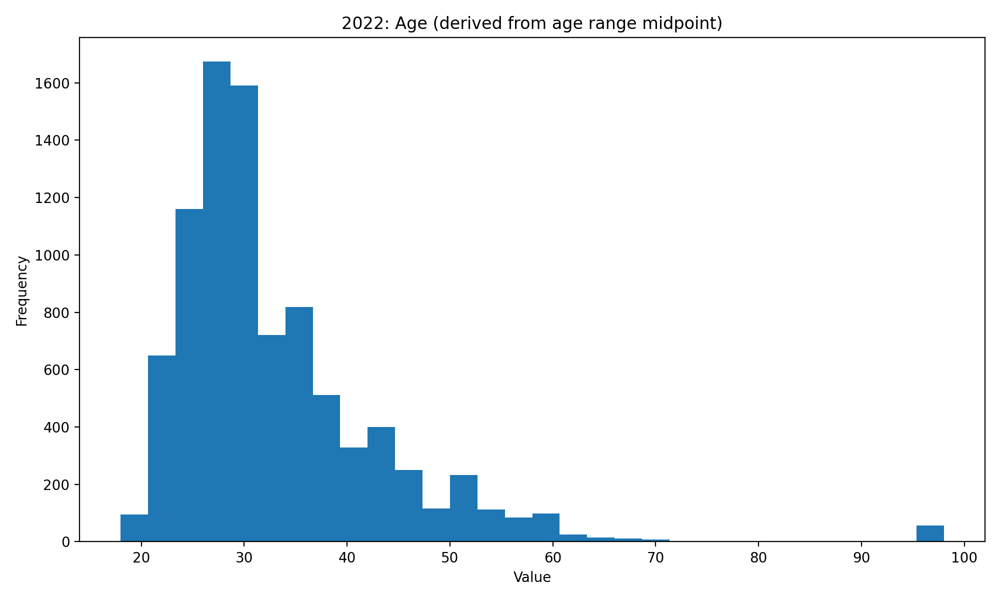

### ethnicity_name_top15.png
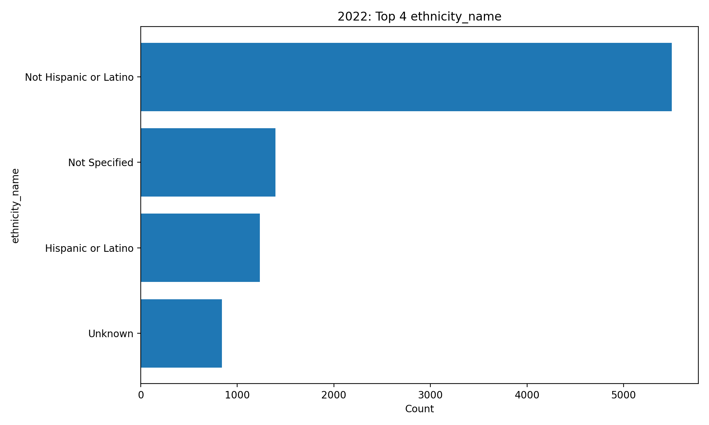

### injury_name_top15.png
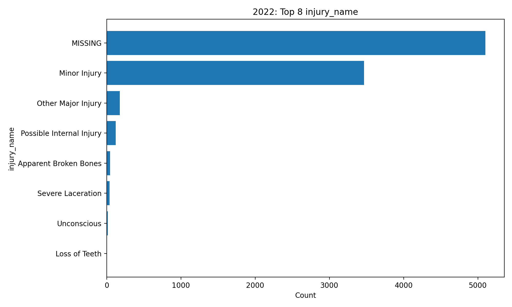

### location_name_top15.png
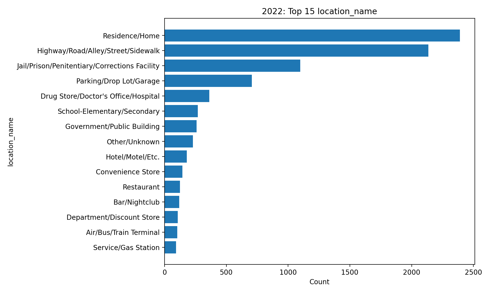

### offense_category_name_top15.png
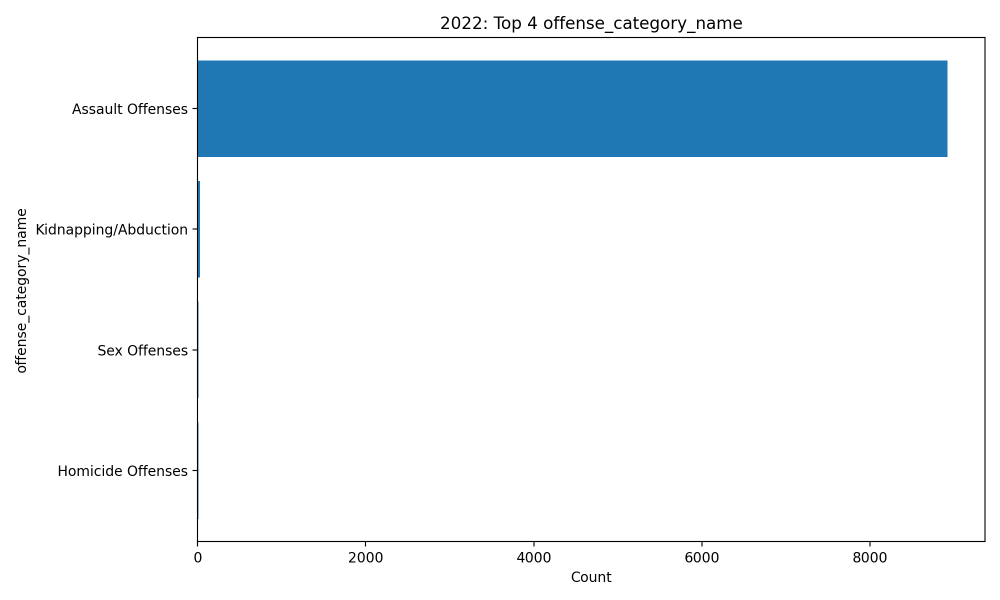

### offense_name_top15.png
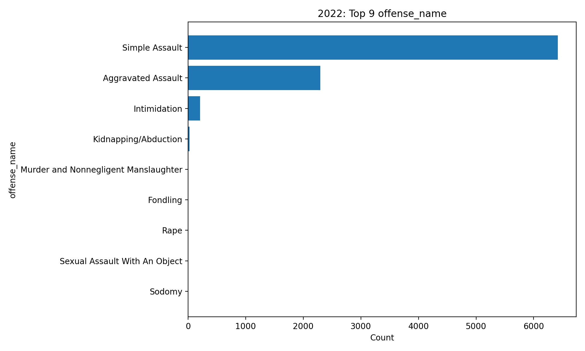

### race_desc_top15.png
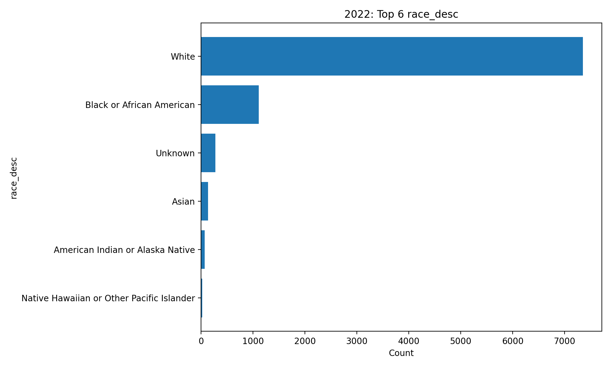

### relationship_name_top15.png
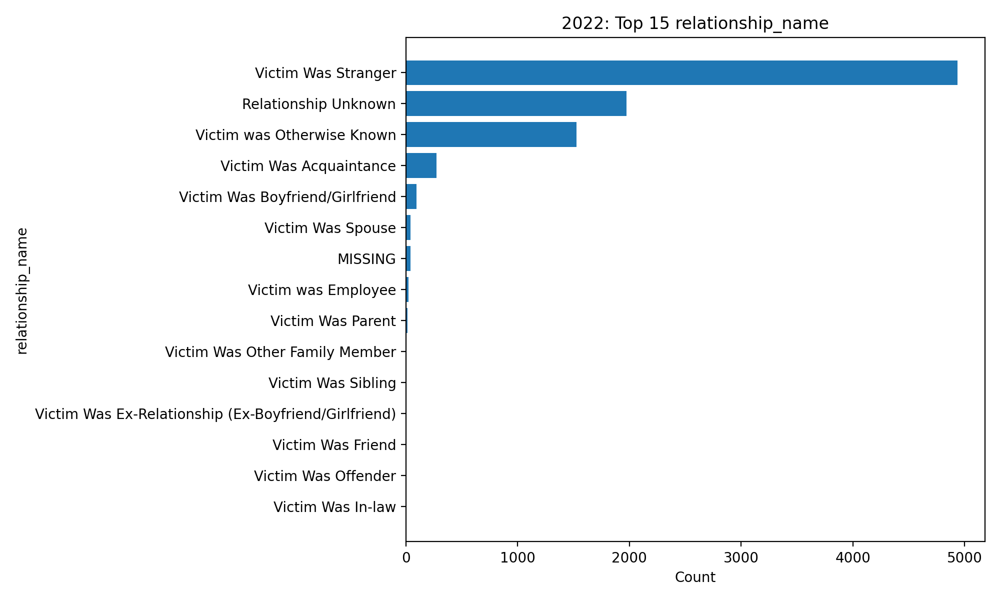

### top_states_by_volume.png
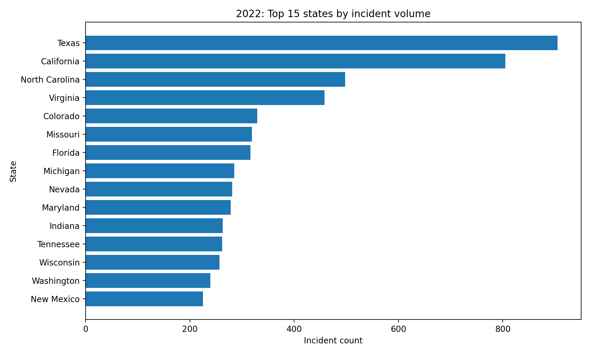

### top_states_firearm_rate.png
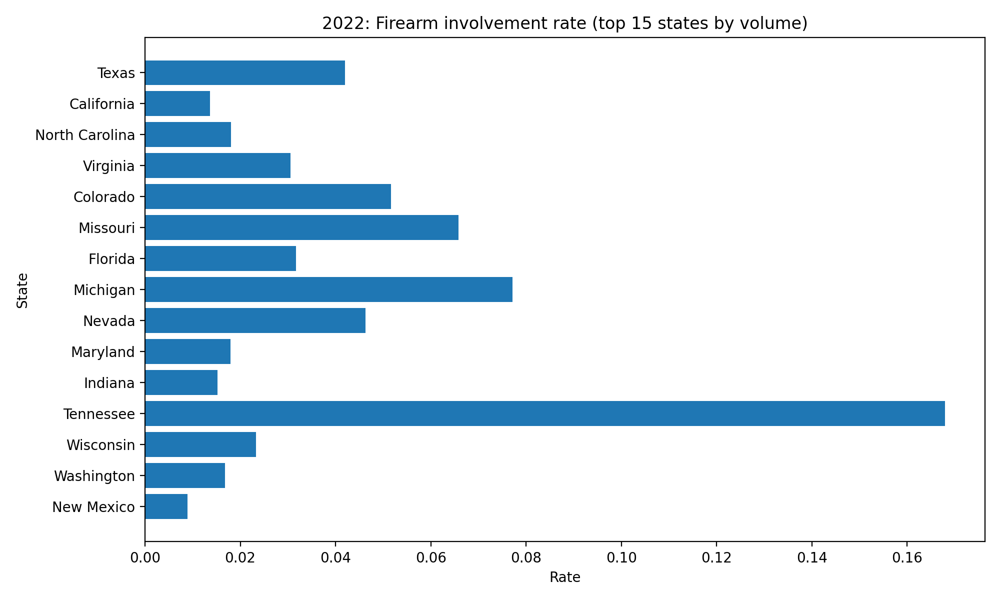

### top_states_ipv_proxy_rate.png
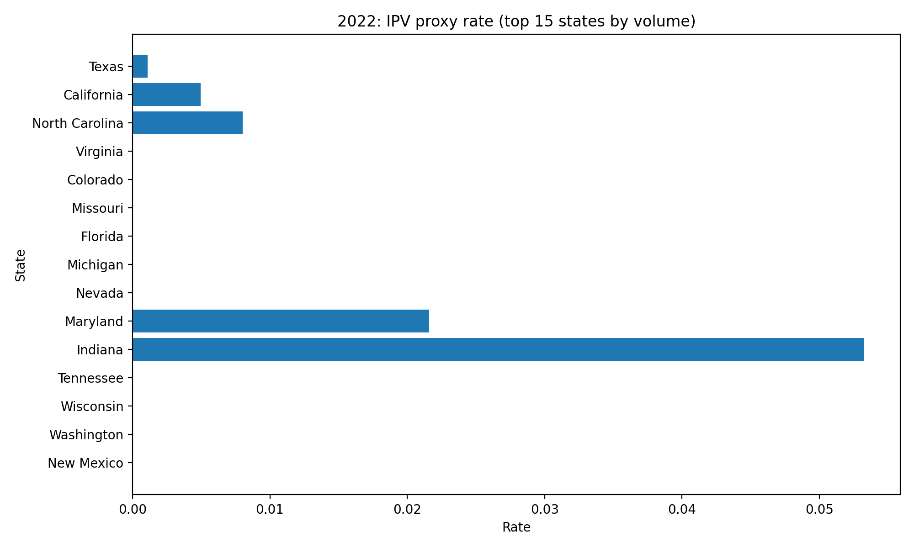

### weapon_name_top15.png
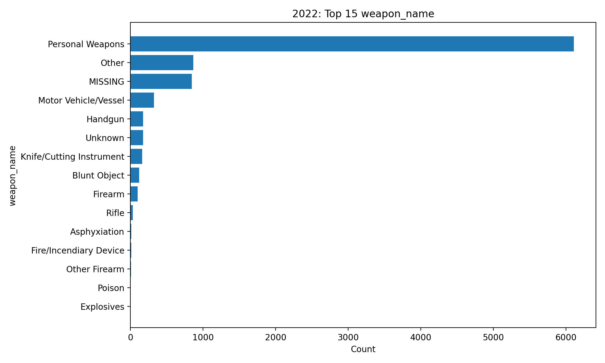
